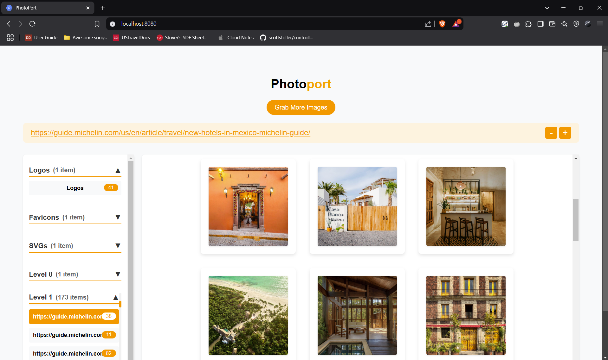
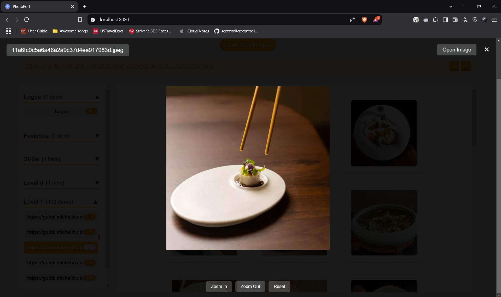
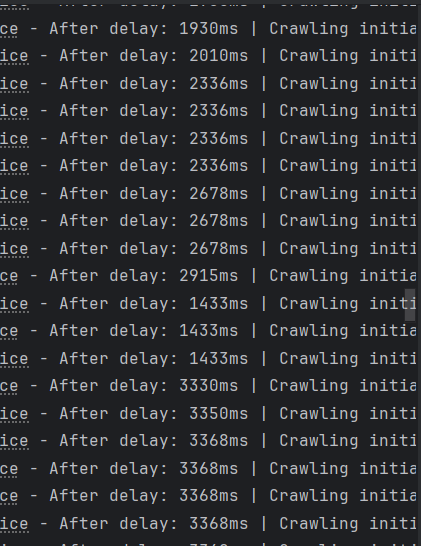

# PhotoPort - Advanced Web Image Crawler

PhotoPort is a sophisticated web application that crawls websites to find and categorize images. Built for the Eulerity Hackathon Challenge, it offers a <b>powerful backend</b> and <b>user-friendly interface</b> for discovering images on the web.




## Key Features

### Intelligent Crawling
- **Multi-threaded Crawling**: Efficiently processes multiple pages simultaneously


- **Recursive Crawling**: Optional deep crawling with configurable levels
- **Adaptive Rate Limiting**: Implements friendly crawling practices to avoid site bans




- **Domain-Safe**: Stays within the same domain as the input URL
- **Duplicate Prevention**: Avoids re-crawling visited pages
- **Exponential Backoff**: In case the webserver starts rejecting requests, exponentially increase the delays in which the requests to crawl are made.


### Performance & Reliability
- **Streaming Response**: Real-time image processing


- **Timeout Handling**: Graceful handling of slow responses
- **Error Recovery**: Automatic form reset on errors
- **Progress Tracking**: Visual feedback during crawling

### Smart Categorization
- **Automatic Classification**: Automatically categorizes images into:
  - Logos
  - GIFs
  - Favicons
  - SVGs
  - Regular images


### User Interface
- **Modern Design**: Clean and intuitive interface
- **Real-time Updates**: Live streaming of found images
- **Interactive Sidebar**: 
  - Hierarchical view of crawled pages
  - Image count indicators
  - Expandable/collapsible sections


- **Image Management**:
  - Adjustable image frame sizes


  - Image preview with tooltips
  - Modal view for detailed inspection
  - Zoom controls for detailed viewing
  - Drag support for zoomed images

## Technical Stack

- **Frontend**:
  - HTML5
  - CSS3 with modern styling
  - Vanilla JavaScript with modern features
- **Backend**:
  - Java 8
  - Jsoup for web crawling
  - Jetty server
  - Maven for build management

## Notes

- The crawler respects website boundaries and implements rate limiting
- Image categorization is based on file types and content analysis
- All images are displayed with proper attribution and source links

## Getting Started

### Prerequisites
- Java 8 (exact version required)
- Maven 3.5 or higher

### Installation

1. Build the project:
```bash
mvn package
```

2. Run the application:
```bash
mvn clean test package jetty:run
```

3. Open your browser and navigate to:
```
http://localhost:8080
```

### Usage

1. Enter a URL in the search bar
2. (Optional) Enable advanced options:
   - Toggle recursive crawling
   - Set crawl depth level
3. Click "Grab Images" to start crawling
4. Use the sidebar to navigate through found images
5. Click on images to view them in detail
6. Use the "Grab More Images" button to start a new search

## File Structure

### Backend
- [`src/main/java/com/eulerity/hackathon/imagefinder/`](./src/main/java/com/eulerity/hackathon/imagefinder/)
  - [`ImageFinder.java`](./src/main/java/com/eulerity/hackathon/imagefinder/ImageFinder.java): Main servlet handling image crawling requests
  - [`service/`](./src/main/java/com/eulerity/hackathon/imagefinder/service): Service layer for image crawling logic
  - [`object/`](./src/main/java/com/eulerity/hackathon/imagefinder/object): Contains classes for storage
  - [`util/`](./src/main/java/com/eulerity/hackathon/imagefinder/util): Contains utility classes and helpers
  - [`config/`](./src/main/java/com/eulerity/hackathon/imagefinder/config): Contains configuration files

### Frontend
- [`src/main/webapp/`](./src/main/webapp)
  - [`index.html`](./src/main/webapp/index.html): Main application interface
  - [`index.css`](./src/main/webapp/index.css): Styles for UI
  - [`index.js`](./src/main/webapp/index.js): Client-side functionality
  - [`favicon.ico`](./src/main/webapp/favicon.ico): Browser tab icon

## License

This project is part of the Eulerity Hackathon Challenge.

---